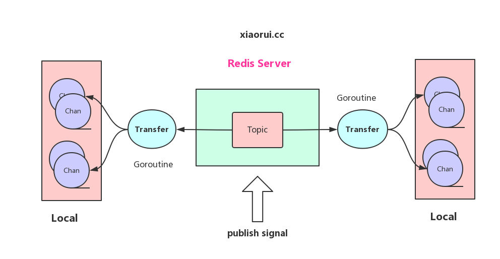

# inpubsub

provide pubsub service for groutines in one golang process

## Feature

To Do List:

* add redis support, pubsub distributed

In cluster, don't need all workers to subscribe to redis topic. reduce the number of connections

* add nsq suport

support nsq pubsub



## Usage

```
ps := inpubsub.NewPubSub()

subscriber1 := ps.Subscribe("t1")
subscriber2 := ps.Subscribe("t1")
subscriber3 := ps.Subscribe("t2")

for _, sub := range []inpubsub.Subscriber{subscriber1, subscriber2, subscriber3} {
	go func(insub inpubsub.Subscriber) {
		for {
			got, ok := <-insub.Read()
			if !ok {
				return
			}
			fmt.Println(got)
		}
	}(sub)
}

ps.Publish("t1", "hi")
ps.Publish("t2", "hello")
```
